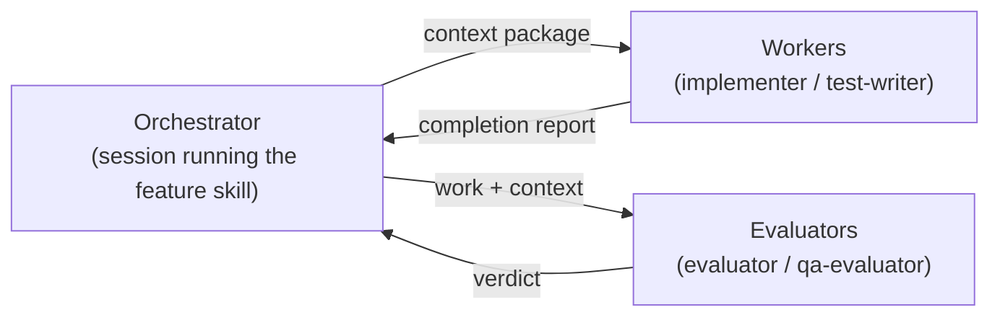
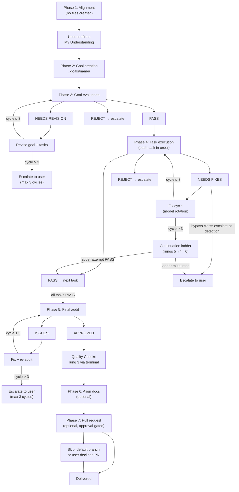
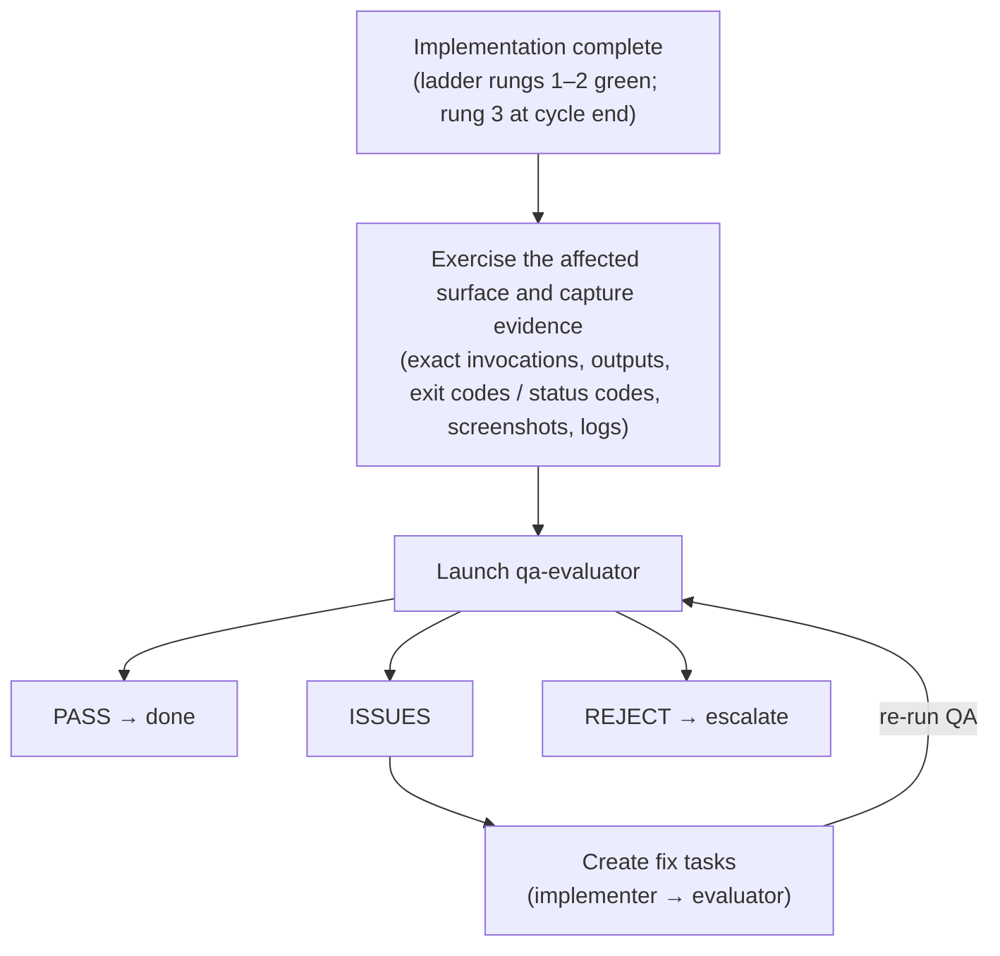
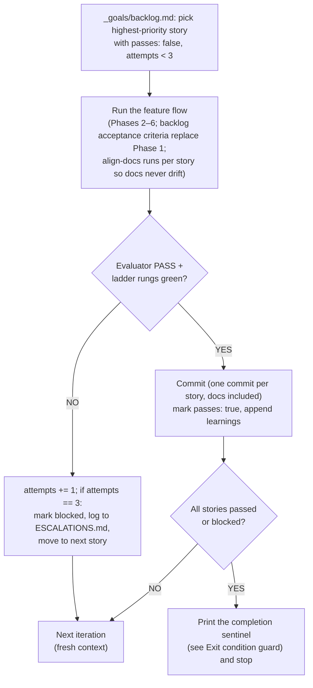

# {{PROJECT_NAME}} Orchestration Architecture

<!-- BOOTSTRAP[kit-meta]: This is a template. Every `{{TOKEN}}` must be replaced and every
     `BOOTSTRAP:` comment resolved (fill the section, then delete the comment)
     when this file is instantiated into a project. See the setup
     skill for the placeholder reference. -->

A guide to how the feature and research orchestration system works for **{{PROJECT_NAME}}**,
including subagent delegation, evaluation cycles, and retry mechanisms.

> **Stack note:** {{STACK_SUMMARY}}
> <!-- BOOTSTRAP[stack-note]: 2–5 sentences — language/runtime, package manager, major code lanes
>      (backend/frontend/CLI/etc.), and where the canonical domain reference lives
>      (domain skill and/or docs file). -->

<!-- IF greenfield -->
### Engineering practices

<!-- BOOTSTRAP[greenfield-practices]: GREENFIELD ONLY — resolve from this install's in-session greenfield
     decision, i.e. the Step 2a accept-and-confirm path. That decision is persisted as
     the manifest's `options.greenfield`. 4–8 sentences, stack-agnostic, stating that
     new behavior is developed test-first — a failing test is written before the
     production code that satisfies it — and that
     modules follow SOLID: one reason to change per unit, dependencies declared
     against ports/abstractions rather than concretions, and no god-files that
     accumulate unrelated responsibilities. Name no language, runtime, or package
     manager; the stack note above already carries that. These are authoring
     conventions for a fresh codebase, not evaluator auto-fail triggers — do not add them
     to the auto-fail table or to any evaluator criteria.

New behavior is developed test-first — a failing test is written before the
production code that satisfies it — and modules follow SOLID: one reason to
change per unit, dependencies declared against ports/abstractions rather than
concretions, and no god-files that accumulate unrelated responsibilities. These
are authoring conventions for a fresh codebase, not evaluator auto-fail
triggers.
-->
<!-- ENDIF greenfield -->

---

## Table of Contents

1. [Core Concepts](#core-concepts)
2. [Component Overview](#component-overview)
3. [Feature Flow](#feature-flow)
<!-- IF research -->
4. [Research Flow](#research-flow)
<!-- ENDIF research -->
5. [QA Evaluation (Optional Behavioral Gate)](#qa-evaluation-optional-behavioral-gate)
6. [Subagent Communication Protocol](#subagent-communication-protocol)
7. [Evaluation & Retry Mechanisms](#evaluation--retry-mechanisms)
<!-- IF loop -->
8. [Autonomous Loop (Optional)](#autonomous-loop-optional)
<!-- ENDIF loop -->
9. [Quick Reference](#quick-reference)

---

## Core Concepts

### Why This Architecture?

Traditional single-agent execution suffers from:

| Problem | Cause | Impact |
|---------|-------|--------|
| **Context Fatigue** | Long conversations exhaust attention | Late tasks get less quality |
| **Sunk Cost Bias** | Agent invested in previous work | Reluctant to reject own output |
| **Optimism Creep** | Desire to "finish" | Cuts corners, skips edge cases |
| **Self-Review Blindness** | Reviewing own work | Misses obvious issues |

### The Solution: Separation of Concerns



| Role | Traits |
|------|--------|
| Orchestrator (coordinates) | Never executes; prepares context; makes decisions; handles retries |
| Workers (execute) | Fresh context; focused task; reports status; checklist-driven |
| Evaluators (verify) | No stake in outcome; defaults to pessimism |

### Key Principle: Fresh Context Per Task

Each subagent invocation:
- Starts with **zero conversation history**
- Receives **only what's in the prompt**
- Returns **one response** to the orchestrator
- Has **no knowledge** of previous attempts or other tasks

This eliminates fatigue and bias completely.

Exception for re-checks: the evaluator is resumed with a delta prompt listing only
the applied fixes; the implementer may be resumed for fix cycle 1 only (cycles 2–3
are fresh spawns). Fresh context remains the rule for first spawns.

### Subagent Invocation: Retry on Transient Failures

Subagent invocations can fail due to transient issues (network timeouts, rate limits, temporary service unavailability). When this happens:

```
ON subagent invocation failure:
  DO NOT assume "subagent must not exist" or fall back to general agent

  INSTEAD:
  1. Retry the same subagent_type with the same prompt (up to 3 attempts)
  2. Wait briefly between retries (exponential backoff: 2s, 4s, 8s)
  3. Only after 3 failed attempts: escalate to user

  NEVER substitute a different subagent type due to transient errors
```

---

## Component Overview

### Orchestrator & Reference Skills (`{{IDE_DIR}}/skills/`)

| Skill | Type | Purpose |
|-------|------|---------|
| `feature` | Coordinator | Plans and executes feature implementation across {{PROJECT_NAME}} layers |
<!-- IF research -->
| `research` | Coordinator | Research → Plan workflow for domain topics |
<!-- ENDIF research -->
| `goal-criteria` | Reference | Criteria for goal evaluation |
| `task-criteria` | Reference | Criteria for task evaluation |
| `qa-criteria` | Reference | Criteria for user-facing QA evaluation |
| `test-ladder` | Supporting | New tests → impacted tests mid-cycle; full suites (rung 3) only at cycle end |
| `align-docs` | Coordinator | Phase 6: evaluator-gated sync of all docs to shipped code (docs-only) |
| `ship-pr` | Delivery | Phase 7: draft + create the PR/MR on the project's forge, or hand over (approval-gated) |
<!-- BOOTSTRAP[domain-skill-rows]: append one row per project domain skill (the canonical knowledge base
     for the problem domain) and per supporting skill (TDD workflow, test ladder,
     smoke testing, frontend rules, visual QA, ...). Only list skills that exist. -->

<!-- IF research -->
<!-- IF loop -->
> `goal-criteria`, `task-criteria`, `qa-criteria`, `test-ladder`, `align-docs`,
> `ship-pr`, and `auto-loop` set `disable-model-invocation: true` — they load via
> `/name` or a cited path, not session-start auto-discovery. `feature` and
> `research` remain auto-invocable.
<!-- ENDIF loop -->
<!-- IF !loop -->
> `goal-criteria`, `task-criteria`, `qa-criteria`, `test-ladder`, `align-docs`,
> and `ship-pr` set `disable-model-invocation: true` — they load via
> `/name` or a cited path, not session-start auto-discovery. `feature` and
> `research` remain auto-invocable.
<!-- ENDIF !loop -->
<!-- ENDIF research -->
<!-- IF !research -->
<!-- IF loop -->
> `goal-criteria`, `task-criteria`, `qa-criteria`, `test-ladder`, `align-docs`,
> `ship-pr`, and `auto-loop` set `disable-model-invocation: true` — they load via
> `/name` or a cited path, not session-start auto-discovery. `feature`
> remains auto-invocable.
<!-- ENDIF loop -->
<!-- IF !loop -->
> `goal-criteria`, `task-criteria`, `qa-criteria`, `test-ladder`, `align-docs`,
> and `ship-pr` set `disable-model-invocation: true` — they load via
> `/name` or a cited path, not session-start auto-discovery. `feature`
> remains auto-invocable.
<!-- ENDIF !loop -->
<!-- ENDIF !research -->

> Domain skills are the project's knowledge base — the orchestration skills above
> reference them but do not replace them. Supporting skills are routed into subagent
> context packages by `feature` (see its "Supporting skills" section)
> based on which layer a task touches.

### Subagents (`{{IDE_DIR}}/agents/`)

<!-- IF models_pinned -->
| Subagent | Behavioral Style | Use Case | Model Tier |
|----------|------------------|----------|------------|
| `evaluator` | Skeptical, problem-finding | Goal / task / code verification | frontier, effort high |
| `qa-evaluator` | Skeptical, user-perspective | Behavioral QA of user-facing surfaces | frontier, effort high |
| `implementer` | Focused, checklist-driven | Implementation + fixes | light, effort medium |
| `test-writer` | Coverage-obsessed | Test creation, all external services mocked | light, effort medium |
| `terminal` | Compact command runner | Any Bash or PowerShell command — returns only the result the caller asked for | light, effort medium |
| `diagnostician` | Analytical, diagnosis-only | Root-cause analysis after fix-cycle exhaustion — no code writes | frontier |
<!-- ENDIF models_pinned -->
<!-- IF !models_pinned -->
| Subagent | Behavioral Style | Use Case |
|----------|------------------|----------|
| `evaluator` | Skeptical, problem-finding | Goal / task / code verification |
| `qa-evaluator` | Skeptical, user-perspective | Behavioral QA of user-facing surfaces |
| `implementer` | Focused, checklist-driven | Implementation + fixes |
| `test-writer` | Coverage-obsessed | Test creation, all external services mocked |
| `terminal` | Compact command runner | Any Bash or PowerShell command — returns only the result the caller asked for |
| `diagnostician` | Analytical, diagnosis-only | Root-cause analysis after fix-cycle exhaustion — no code writes |
<!-- ENDIF !models_pinned -->

The roster is six subagents — `evaluator`, `qa-evaluator`, `implementer`, `test-writer`,
`terminal`, and `diagnostician` — each with a dedicated agent file under `{{IDE_DIR}}/agents/`.

The orchestrator (and any worker that can spawn) sends `terminal` an exact Bash or
PowerShell command plus the result shape it needs; `terminal` executes it and returns
only that result, so the raw stream never lands in the caller. Rung 3 is always a
`terminal` spawn.

<!-- IF models_pinned -->
**Model tiers:** The orchestrator (main session) and both evaluators run the **frontier**
tier — delegation and evaluating have a capability floor. The light-tier agents — the
two workers **plus** `terminal` — run the **light** tier — checklist-driven execution
and compact command running keep quality when the plan and verification are strong, at
a fraction of the output-token cost. Model IDs are configuration, not constants: the
resolved per-harness model ID for each tier lives in exactly one place, the model map,
and is pinned into each agent's config from there — on harnesses with a skills tree
(Claude Code, Cursor) the map is also copied to `{{IDE_DIR}}/skills/setup-models.map.md`
for reference, while the Copilot and Codex emitters place no reference copy of the map,
so their pins live only in the harness's own config/frontmatter (Copilot `.agent.md`
frontmatter, Codex `.codex/agents/<role>.toml`), resolved from the map at setup time;
update the map (and re-pin) when providers rotate names. Harness caveats: on
Copilot a subagent cannot run a stronger model than the session (so the session itself
must run the frontier tier); Cursor silently falls back to a compatible model under
admin/plan restrictions, and does the same — without erroring — when the resolved ID is
unknown or stale (evaluators should report which model produced the verdict).
Every spawn passes its model explicitly; agents self-report the model in their first
report line.
<!-- ENDIF models_pinned -->

---

## Feature Flow

### Complete Lifecycle



### Phase notes

**Phase 1 — Alignment (structured discovery).** Stay in Agent Mode and ask structured
questions (5-20 MCQs), with follow-up rounds if needed; then summarize "My
Understanding" and wait for the user to confirm before Phase 2. IMPORTANT: no files
are created during this phase. Discovery covers: problem, affected layer/lane,
external surfaces touched, auth/permissions, behavior/error handling, interface
shape, existing patterns to follow, priority.

**Phase 2 — Goal creation (with decision gates).** Create `_goals/[name]/` and write
`goal.md`. For each task: if multiple viable approaches exist, present them to the
user and WAIT for the decision; only then create the task file. Each task file carries
`## Acceptance Criteria` (criterion + verification method each); the Phase 3 evaluator
validates these once for all tasks.

**Phase 3 — Goal evaluation (mandatory re-evaluate loop).** Launch the evaluator with
the Phase 1 Q&A included (for the Discovery Coverage check). PASS → Phase 4; NEEDS
REVISION → revise the goal + tasks and re-evaluate (3 max); REJECT → escalate to the
user.
INVARIANT: The ONLY exit to Phase 4 is a PASS verdict from the evaluator subagent.
Revisions MUST be re-evaluated.

**Phase 4 — Task execution (mandatory re-evaluate after every fix).** For each task,
in dependency order:

- Step 1: Launch implementer (or test-writer for the test task) — the context
  package includes the task file (including its Acceptance Criteria)
- Step 2: Receive completion report
- Step 3: Launch evaluator
- Step 4: Handle verdict — PASS or PASS (with notes) → next task (`PASS (with notes)`
  counts as PASS; copy notes into the orchestration log); NEEDS FIXES → fix cycle (model
  rotation) and re-evaluate, 3 max, then read `goal.md`'s `phases.ladder`: `auto` → the
  continuation ladder (rungs 5→4→6 — see Evaluation & Retry Mechanisms) before
  escalation; `escalate` (default) → escalate to the user with the ladder offered as
  option 1; REJECT → escalate to the user.
  A verdict tagged with a bypass failure class (destructive/security/infra)
  escalates at detection, on any cycle.

INVARIANT: A task is only marked complete after the evaluator returns PASS or
PASS (with notes) (`PASS (with notes)` counts as PASS). There is no path where
fixes are made and the orchestrator proceeds without re-verification.

**Phase 5 — Final audit (mandatory re-audit loop).** All tasks complete → final
evaluator audit. APPROVED → Quality Checks (ladder rung 3: full suites, via a
`terminal` spawn); ISSUES → fix (ladder rungs 1–2), then re-audit (3 max).
INVARIANT: The ONLY exit to Quality Checks is an APPROVED verdict from the audit
subagent. Remediations MUST be re-audited.

**Phase 6 — Align docs (evaluator-gated doc sync, optional).** Default is
`align_docs: false`; enabled by the Phase 1 answer. After Phase 5 Quality
Checks, the orchestrator reads `goal.md`'s `phases:` block — when `align_docs: false`,
skip Phase 6 with an orchestration-log entry ("Phase 6 skipped per goal.md"). When
enabled, Quality Checks green → the align-docs skill: discover the shipped surface →
per-doc edit plan → evaluate the plan → implementer per doc → evaluate each doc →
final doc audit (same re-evaluate invariants and 3-cycle limits as Phases 3–5).
RULES: docs-only (never code), anti-invention (every claim traces to a read file),
`_research/` and `_goals/` are READ-ONLY.

**Phase 7 — Pull request (approval-gated, optional).** After Phase 6 (or its skip),
the orchestrator reads `goal.md`'s `phases:` block — when `pull_request: false`, skip
Phase 7 with an orchestration-log entry ("Phase 7 skipped per goal.md"). When enabled,
docs aligned → the ship-pr skill: analyze branch commits + diff → draft the PR (exec
summary + technical breakdown) → show the draft → USER APPROVES → push (if needed) →
create the PR/MR or hand over → URL. Also skip when the work happened directly on the
default branch or the user declines a PR.
INVARIANT: The PR is never created before the user approves the draft.

### Forge adapter (Phase 7 delivery)

Phase 7 (`ship-pr`) classifies git remotes at invocation time and branches on the forge. **Phase 7 is never deleted from an install** — a repo with no detected forge takes the `none` branch (draft + human hand-over), not a removed phase.

**Taxonomy.** Four values; each names its create mechanism:

| Value | Create mechanism |
|-------|------------------|
| `github` | `gh pr create` |
| `azuredevops` | `az repos pr create` |
| `gitlab` | `glab mr create` |
| `none` | draft + hand-over; never creates |

**Detection.** Classify the chosen remote's URL by domain. Host patterns live only in this table:

| Host pattern | Forge |
|--------------|-------|
| `github.com` | `github` |
| `dev.azure.com`, `ssh.dev.azure.com`, `*.visualstudio.com`, `vs-ssh.visualstudio.com` | `azuredevops` |
| `gitlab.com` | `gitlab` |

The `_git` path segment is the strong signal on Azure DevOps URLs. Anything else classifies to `none` unless overridden. Self-hosted GitLab, GHE (GitHub Enterprise), and on-prem Azure DevOps Server are pattern-undetectable — override-only.

**Remote selection.** Choose the PR-target remote with this procedure:

1. Classify every remote's URL per the taxonomy.
2. A candidate is a remote that classifies to a known forge (`github`, `azuredevops`, `gitlab`). `none`-classified remotes (for example a deploy remote) are NOT candidates and can never trigger disagreement.
3. If candidates span two or more different forges, stop and ask the human — never pick silently.
4. Otherwise pick the PR-target remote by precedence `upstream` → a remote named for its forge (`github`, `azuredevops`/`azure`, `gitlab`) → `origin` → remaining candidates in `git remote` listed order.
5. Zero candidates → the `none` branch unless the manifest override names a forge.

**PR-target remote vs push remote.** Forge classification and base-branch resolution use the chosen PR-target remote. `git push` uses the branch's existing tracking remote if set, else `origin`. A GitHub fork setup (`origin` = fork, `upstream` = parent) keeps pushing to the fork while targeting the parent, exactly as `gh` behaves.

**Override.** In `orchestration-kit.manifest.json`, `options.forge` (one of the four taxonomy values) and optional `options.forgeHost` (self-hosted host mapping) beat detection. The adapter never writes `git config`.

**Base-branch resolution.** Resolve always against the chosen PR-target remote. Name that remote explicitly in every base-resolution command (`ls-remote`/`fetch`/`log`/`diff`) — never a bare hardcoded `origin` in those templates.
Primary resolver: `git ls-remote --symref <remote> HEAD`.
Offline fallback: the cached `refs/remotes/<remote>/HEAD` symref (repair with `git remote set-head <remote> -a`).
On the `github` branch, `gh repo view` remains an accepted resolver.

**Stop and ask** when:

- (a) the chosen remote's HEAD is unresolvable (cached symref unset AND `ls-remote` fails or is auth-blocked);
- (b) two candidate remotes resolve to different forges;
- (c) the resolved base differs from the branch the current commits diverged from.

The human-approval invariant (draft → user approves → create/hand over) holds in all four branches. On-prem Azure DevOps Server is routed to the `none` branch (Microsoft: `az repos` CLI is Services-only).

### Execution Order for {{PROJECT_NAME}}

```
SEQUENTIAL: {{EXECUTION_LAYERS}}
                │
                ▼ (implementation complete)
                │
            Tests (test-writer; ladder rungs 1–2 only)
                │
                ▼ (new + impacted tests pass)
                │
            Final Audit ──► Quality Checks (rung 3: full suites)
                │
                ▼
            Align Docs (Phase 6) ──► Pull Request (Phase 7)
```
<!-- BOOTSTRAP[execution-layers]: {{EXECUTION_LAYERS}} is the project's dependency-ordered layer chain,
     e.g. "Shared Core (if new lane) → Capability Module → CLI → Packaging". -->

Per-task and TDD verification follows the `test-ladder` skill: rung 1 (new
tests) → rung 2 (impacted tests) mid-cycle; rung 3 (every stack's full suite) runs
at cycle end — in the orchestrator's Phase 5 Quality Checks after the audit is APPROVED,
and additionally in a goal's designated closer task when one exists (a Phase 4 worker
gate with a written mandate that never replaces Phase 5).

Use only the layers the feature actually touches — most features reuse shared
infrastructure and add one module plus its interface and tests.

### Evaluation intensity (`eval_depth`)

Every task file's ownership-contract block carries `eval_depth: light` (default) or
`full`. It is orchestrator-set at planning time only — a worker never sets it — and
`light` is never a skip: it shortens the evaluator's rubric to a requirements walk +
targeted tests + write-fence check, while still ending in a real PASS / NEEDS FIXES /
REJECT verdict. `full` is required (reason stated in the task file) for contract/
scaffold tasks, tasks with interface consumers (mirroring, documenting, or testing
the output does not count), and tasks writing agents, criteria skills, loop
drivers/breakers, or shared infrastructure named in the goal; `goal-criteria` flags
an unexplained `full` and fails a missing field closed to `full`.

Maintainers periodically compare the verdicts recorded in each goal's
`orchestration-log.md` against what actually happened afterward, then tune the
**criteria skills** — never the evaluator's fixed stance — when its behavior drifts
(see `evaluator.md`'s tuning note). This log-driven ritual is how both `eval_depth`
routing and the evaluation criteria stay calibrated over time.

---

<!-- IF research -->
## Research Flow

For domain topics an external research agent must investigate without codebase access.

```
Phase 1: Generate Research Prompt → _research/prompts/[topic].md  (user copy-pastes out)
Phase 2: Ingest Research Report   → _research/[topic]/report.md
Phase 3: High-Level Plan          → Collaborative planning (Plan Mode)
Phase 4: Low-Level Tasks          → _goals/[goal-name]/ structure
```

**Research locations:**
- {{GROUND_TRUTH_DOC}} — committed ground-truth reference. Cite as ground truth.
- `_research/` — working/scratch area for new prompts and raw reports. Promote durable
  findings into {{GROUND_TRUTH_DOC}}.

The output of Phase 4 (`_goals/[goal-name]/`) enters the `feature` skill at Phase 3 (goal evaluation) — it must PASS the evaluator before Phase 4 execution begins.

---
<!-- ENDIF research -->

## QA Evaluation (Optional Behavioral Gate)

User-facing QA is a lightweight, optional gate run with the `qa-evaluator` subagent after a feature
is implemented. It covers **all user-facing surfaces**:

<!-- BOOTSTRAP[qa-surfaces]: list this project's user-facing surfaces and the evidence each produces,
     e.g. CLIs (invocation, stdout/stderr, exit codes), API endpoints (status codes per
     route via a smoke-testing skill), web UI (screenshots/console/network via a visual
     QA skill), library entry points.
- {{QA_SURFACES}}
-->



QA never fixes issues — it finds them. Fixes flow back through the standard
implementer + evaluator loop, then QA re-runs.

---

## Subagent Communication Protocol

### Context Package Structure

Every subagent invocation requires a complete context package:

```
┌─────────────────────────────────────────────────────────────────┐
│  SECTION 1: ROLE ASSIGNMENT                                      │
│  "You are the [subagent-name] subagent."                        │
│  "Read: {{IDE_DIR}}/agents/[subagent-name].md"                  │
├─────────────────────────────────────────────────────────────────┤
│  SECTION 2: TASK DEFINITION                                      │
│  "## Task"                                                       │
│  "[Clear description of what to accomplish]"                    │
├─────────────────────────────────────────────────────────────────┤
│  SECTION 3: INPUT DATA                                          │
│  "## Requirements" (exhaustive list)                            │
│  "## Files to Read" (explicit paths)                            │
│  "## Domain Reference" (domain skill + ground-truth excerpts)   │
├─────────────────────────────────────────────────────────────────┤
│  SECTION 4: CONSTRAINTS                                         │
│  "## Write fence" (the task's writes list)                      │
│  "## Model" (requested ID · tier · rotation)                    │
│  "## Rules" or "## Critical Requirements"                       │
│  - Must do X (e.g. reuse shared core modules)                   │
│  - Must NOT do Y (e.g. re-implement auth, hit live services)    │
├─────────────────────────────────────────────────────────────────┤
│  SECTION 5: OUTPUT FORMAT                                       │
│  "## Output"                                                    │
│  "[Exact structure expected in response]"                       │
└─────────────────────────────────────────────────────────────────┘
```

### Orchestration log (spawn ledger)

`_goals/[goal-name]/orchestration-log.md` is an append-only spawn ledger written ONLY
through the emitted tool `_kit/log-spawn.sh` (`pwsh _kit/log-spawn.ps1` on Windows —
same flags, byte-identical output). The orchestrator runs it inline (one-line output;
exempt from the `terminal` spawn rule). The header's running io_est_tokens /
work_est_tokens totals are "see latest entry" — the script never rewrites a line.
Every entry references artifact files rather than inlining them:

- `_goals/<goal>/spawns/NN-context.md` — the full context package as sent (NN = next
  free two-digit number, chosen by the orchestrator). This is the verbatim record.
- `_goals/<goal>/spawns/NN-report.md` — the subagent's report, verbatim, never polished.
  Agents end with a `### Footprint` block (`files_read: N (~C chars)` / `commands_run: N`).

Three subcommands (`--help` lists every flag):

- **Before launch** — `spawn --goal G --agent A --phase "P" --model-requested M --context _goals/G/spawns/NN-context.md [--writes …] [--why …] [--expect …]`
  appends `### <ts> — SPAWN A (P) [#NN]` plus bullet lines for agent · model requested,
  why, writes claim, expected output, and `context: <path> · context_chars: <N>` (N =
  measured file bytes).
- **After return** — `outcome --goal G --spawn NN --report _goals/G/spawns/NN-report.md --verdict "V" --model-reported "M" [--note …] [--work-chars C]`
  appends `- OUTCOME [#NN]: V · model reported: M · report: <path> · report_chars: <R> · io_est_tokens: <T> · work_read_chars: <C|n/a> · work_est_tokens: <W|n/a> · running io: <X> · running work: <Y>`
  where `io_est_tokens` T = (`context_chars` + `report_chars`) / 4 — orchestrator I/O
  proxy (chars/4), not the subagent's spend — and `work_est_tokens` W comes from the
  Footprint `files_read` line (W = C/4; `n/a` if missing/malformed — flag to the
  evaluator; `--work-chars C` overrides). `running io` / `running work` are the previous
  totals plus T / W (`running io` falls back to pre-v0.26 `running total`; W=`n/a` adds 0).
- **Everything else** — `note --goal G --text "…"` appends `### <ts> — …` for phase
  completions, ladder transitions (with the rung name), guard trips, and skips (e.g.
  Phase 6/7 declined via `goal.md`'s `phases:` block).

Exit codes: 0 ok · 2 usage error · 3 ledger integrity (duplicate SPAWN/OUTCOME `[#NN]`,
outcome without its SPAWN) · 4 missing goal directory or artifact file. Rejections and
respawns are new entries with new NNs, never in-place edits.

---

## Evaluation & Retry Mechanisms

### Continuation ladder (Phase 4 task execution)

When Task Execution (Phase 4) exhausts its 3 implement→evaluate fix cycles, read
`goal.md`'s `phases.ladder`. `escalate` (default, or key absent): escalate to the user
with the continuation ladder offered as option 1. `auto`: run this ladder before
terminal human escalation. Apply in this order:

1. **Bypass check (every verdict, every cycle).** A verdict tagged with a bypass failure
   class (`destructive`, `security`, `infra`) stops all retrying immediately — including
   cycles 1–3 — and escalates to the human. Requirement ambiguity routes through rung 5,
   not the bypass — it is not a bypass class.

2. **Rung 5 — arbitration (conditional, checked first on exhaustion).** If cycles 1–3 all
   failed on the *same* required-fix item (unanimous-failure heuristic), spawn the
   evaluator in **arbitration mode** on `{{MODEL_FRONTIER_ALT_FAMILY}}` before any
   further fixing. Outcomes: `criteria-defective` → escalate to the human carrying the
   specific defect; arbiter/primary **disagreement → escalate (never auto-resolve)**;
   `criteria-sound` → continue to rung 4.

3. **Rung 4 — diagnosis-first.** Spawn the `diagnostician` (frontier tier, no code writes)
   with the task file (including its Acceptance Criteria), and all three fix-cycle histories. If its
   hypothesis matches a previously tried fix signature → skip to rung 6 if it recommended
   a split, else escalate. Otherwise run **ONE** diagnosis-driven implementation attempt
   (fresh implementer on `{{MODEL_FRONTIER}}`, using the diagnostician's rewritten
   required-fixes list) and re-evaluate.

4. **Rung 6 — decomposition + selective retry.** Only on a diagnostician split
   recommendation; the orchestrator derives subtasks with ownership contracts (write sets
   ⊆ the parent task's) from the **failing pieces only** — work earlier cycles
   implemented that the evaluator did not flag stays as-is, is not re-run, and gets no
   separate evaluation. The parent task is complete when every derived subtask has an evaluator PASS. Each subtask gets one implement→evaluate cycle; evaluator spawns never consume the attempt budget — only implementation attempts do.

5. **Terminal.** Human escalation with the full ladder history.

**Failure-class taxonomy (closed set):** `implementation` (default) · `criteria-defect`
· `destructive` · `security` · `infra`. Bypass subset — destructive, security, infra.

**Hard guards:**

- At most **3 additional implementation attempts** after cycle 3, summed across rungs 4
  and 6.
- A **repeated failure signature** stops the ladder immediately.
- Every rung transition is an orchestration-log entry recording agent, model, rung, and
  trigger.
- Token/cost budgets are not a guard in interactive mode (no harness exposes true usage to the
  orchestrator); the headless loop records real usage per iteration via `LOOP_USAGE_FORMAT` — gating on it is a future knob, not this ladder's.

**Attempt accounting:** The diagnosis-driven implementation attempt costs 1 of the 3.
Each rung-6 subtask implement→evaluate cycle costs 1 of the 3. Before splitting, the
orchestrator compares the failing-subtask count against the remaining budget — if the
count exceeds the remaining budget, escalate instead of splitting. **Signature identity:**
the evaluator's required-fixes list as recorded in the orchestration log, identical to an
earlier cycle's list item-for-item after normalizing whitespace and list numbering.

**Deferred future rungs (out of scope):**

- **high-effort pin** — evidence-marginal for routine coding; no procedure defined here.
- **best-of-N** — conflicts with disjoint write-set admission; no procedure defined here.

The headless loop inherits this ladder because each iteration runs the phased flow; the
loop drivers' per-story attempt cap and circuit breakers stay the unchanged outer
backstop.

### Retry Limits by Phase

| Phase | Max Cycles | On Exhaust |
|-------|------------|------------|
| Goal Evaluation (Phase 3) | 3 revise→re-evaluate | Escalate to user |
| Task Execution (Phase 4) | 3 implement→evaluate per task | phases.ladder=auto: continuation ladder (rungs 5→4→6) then escalate; escalate (default): escalate to user, ladder offered |
| Final Audit (Phase 5) | 3 fix→re-audit | Escalate to user |
| Align Docs (Phase 6) | 3 per doc + 3 for plan and final doc audit | Escalate to user |
| Pull Request (Phase 7) | n/a — gated on explicit user approval | User edits or declines the draft |
| QA Gate (optional) | bounded by runtime; fixes loop through impl+evaluate | Escalate if unresolved |

### Mandatory Re-Evaluate Invariants

- **Phase 3**: Goal evaluation loop ONLY exits to Phase 4 via a PASS verdict. Revisions without re-evaluate are forbidden.
- **Phase 4**: A task is ONLY marked complete after the evaluator returns PASS or PASS (with notes) (`PASS (with notes)` counts as PASS). Fixes without re-evaluate are forbidden.
  Fix cycles rotate models — cycle 2 uses a different model family, cycle 3 the frontier tier (see the model map) — and every spawn is recorded in the goal's append-only orchestration log.
- **Phase 5**: Audit loop ONLY exits to Quality Checks via an APPROVED verdict. Remediations without re-audit are forbidden.
- **Phase 6**: A doc is ONLY complete after the evaluator returns PASS; the doc set ONLY ships after the final doc audit returns APPROVED. `_research/`, `_goals/`, and code are never touched.
- **Phase 7**: The PR/MR is ONLY created, or the hand-over printed, after the user approves the drafted title and body.

### Escalation Format

```markdown
## Escalation Required

**Phase**: [current phase]
**Issue**: [what went wrong]
**Attempts**: [what was tried]
**Ladder**: [rungs attempted and their outcomes]

**Options**:
1. [option with tradeoffs]
2. [option with tradeoffs]

**What I need from you**: [specific decision or input]
```

For `criteria-defective` escalations (from rung 5 arbitration), state the defective
criterion **verbatim** in the **Issue** line.

---

<!-- IF loop -->
## Autonomous Loop (Optional)

The `auto-loop` skill runs the orchestration flow unattended, **one feature per
iteration**, pulling work from a backlog instead of Phase 1 user alignment. Each
iteration is a fresh context; all state lives in files and git.

**Dual-mode dispatch** (see `auto-loop` and the loop driver): in **driver-dispatched**
runs the driver picks the story, performs `writes:` write-set admission against
in-flight claims, increments `attempts` at claim time, and integrates via the
single-writer integrator; dispatched slots never re-select stories, never increment
`attempts`, and never print the completion sentinel — that sentinel belongs to
**manual** runs only. Concurrency: `LOOP_SLOTS` > 1 is honored iff `LOOP_WORKTREE=1`
(default 2, clamped [1,3]). Usage capture: `LOOP_USAGE_FORMAT` (`auto`|`claude`|`codex`|
`cursor`|`none`; `auto` = basename of `LOOP_CLI`'s first word) and optional `LOOP_USAGE_LOG`. When a
format is active the driver prints `usage: input=<n> output=<n> cache_read=<n|n/a>
cache_write=<n|n/a> cost_usd=<x|n/a> format=<f>` after each slot's `tail -n 25` block
(silent when unset and `auto` resolves to none).

**Manual-mode view** (human-invoked or non-dispatched `auto-loop`):



**Guards (non-negotiable):**

| Guard | Default |
|-------|---------|
| Max iterations per run | 10 (argument to the loop driver (`loop.sh`/`loop.ps1`)) |
| Per-story attempt cap | 3, then blocked + escalation entry |
| Circuit breaker | per slot: retire after 3 consecutive no-commit reaps or 5 identical failure signatures (run continues); every slot retired stops the run — exit 3 if any signature-retirement, else 2 |
| Model breaker | CLOSED/OPEN/HALF-OPEN on anchored rate-limit detection; 600s cooldown, 2 successes to close; falls down the loop model chain, omit-pin at chain end; OPEN sleeps instead of hammering; rate-limited passes CB1-exempt |
| Exit condition | driver-dispatched runs: the driver's own backlog re-scan, gated on zero quarantined branches (exit 0); manual runs: explicit `<promise>COMPLETE</promise>` sentinel — never inferred from prose |
| Merge gate | evaluator PASS + green ladder rungs 1–2 before any commit; rung 3 per story after that story's Phase 5 audit, before that story's commit |
| Docs | align-docs (Phase 6) runs per story — doc updates land in the story's commit |
| Protected paths | the loop may not modify `_loop/`, kit agents/skills, the manifest, or `.gitattributes` — the loop driver (`loop.sh`/`loop.ps1`) reverts the iteration and stops (exit 4) |
| Memory gates | `_goals/LEARNINGS.md` ≥ 15 KB → compact; `_goals/ESCALATIONS.md` ≥ 20 KB → archive resolved entries |
| Shipping | the loop never pushes; at run end, `ship-pr` (Phase 7) drafts and creates the PR/MR on the project's forge, or hand over, with the user approving the draft |
| Sandbox | run in a worktree/container with minimal credentials; never skip permission prompts outside a sandbox |

**Exit funnel** (driver-aggregated across slots; precedence **4>3>2>1>0** — exit 4 and
exit 5 short-circuit): **exit 1** = max-iterations reached with eligible stories
remaining, or drained backlog with quarantined branches retained; **exit 5** = setup or
integration failure (tracked-instance preflight, missing/unreadable backlog, PROMPT.md
substitution point, non-fast-forward integration). Quarantine markers
`.loop-worktrees/QUARANTINE-<branch>.md` (reasons: `mismatch|abnormal|subset|killed`)
block exit 0 until inspected.

Known failure mode: loops can burn large budgets without converging — prefer more,
smaller stories (each sized to one context window) and let the circuit breaker stop a
drifting run early. Headless entry point: `_loop/loop.sh [max-iterations]` (bash) or
`pwsh _loop/loop.ps1 [MaxIterations]` (PowerShell 7+).

---
<!-- ENDIF loop -->

## Quick Reference

### File Locations

<!-- IF research -->
<!-- IF loop -->
```
{{IDE_DIR}}/
├── agents/
│   ├── evaluator.md     # Skeptical code/goal/task reviewer
│   ├── qa-evaluator.md              # Skeptical user-facing QA reviewer
│   ├── implementer.md  # Focused implementer
│   ├── test-writer.md           # Test creator (external services mocked)
│   ├── terminal.md              # Bash/PowerShell runner — returns only the asked-for result
│   └── diagnostician.md         # Diagnosis-only (post-cycle-3, no code writes)
│
├── skills/
│   ├── feature/       # Feature coordination
│   │   ├── SKILL.md
│   │   ├── reference/continuation-ladder.md
│   │   └── templates/{goal.md,task.md}
│   │
│   ├── research/ # Research → Plan
│   │   ├── SKILL.md
│   │   └── templates/{research-prompt.md,research-report.md}
│   │
│   ├── goal-criteria/SKILL.md         # Goal evaluation criteria
│   ├── task-criteria/SKILL.md         # Task evaluation criteria
│   ├── qa-criteria/SKILL.md           # User-facing QA evaluation criteria
│   ├── test-ladder/SKILL.md    # Rungs 1–2 mid-cycle, rung 3 at cycle end
│   ├── align-docs/SKILL.md            # Phase 6: evaluator-gated doc sync
│   ├── ship-pr/SKILL.md       # Phase 7: approval-gated PR creation
│   └── auto-loop/SKILL.md             # One autonomous iteration (if loop enabled)
│
└── ORCHESTRATION.md   # This file

_goals/backlog.md               # Story backlog for the autonomous loop (if enabled)
_goals/<goal>/orchestration-log.md  # Append-only spawn ledger per goal (written by _kit/log-spawn.*)
_goals/<goal>/spawns/NN-context.md  # Context package sent to spawn #NN (verbatim)
_goals/<goal>/spawns/NN-report.md   # Report returned by spawn #NN (verbatim)
_goals/breaker-state.json       # Model circuit breaker state (runtime, gitignored)
_kit/{log-spawn.sh,log-spawn.ps1}  # Single-copy tools: orchestration-log writer twins
_loop/{loop.sh,loop.ps1,breaker.sh,breaker.ps1,PROMPT.md}  # Headless loop driver (if enabled)
```
<!-- ENDIF loop -->
<!-- IF !loop -->
```
{{IDE_DIR}}/
├── agents/
│   ├── evaluator.md     # Skeptical code/goal/task reviewer
│   ├── qa-evaluator.md              # Skeptical user-facing QA reviewer
│   ├── implementer.md  # Focused implementer
│   ├── test-writer.md           # Test creator (external services mocked)
│   ├── terminal.md              # Bash/PowerShell runner — returns only the asked-for result
│   └── diagnostician.md         # Diagnosis-only (post-cycle-3, no code writes)
│
├── skills/
│   ├── feature/       # Feature coordination
│   │   ├── SKILL.md
│   │   ├── reference/continuation-ladder.md
│   │   └── templates/{goal.md,task.md}
│   │
│   ├── research/ # Research → Plan
│   │   ├── SKILL.md
│   │   └── templates/{research-prompt.md,research-report.md}
│   │
│   ├── goal-criteria/SKILL.md         # Goal evaluation criteria
│   ├── task-criteria/SKILL.md         # Task evaluation criteria
│   ├── qa-criteria/SKILL.md           # User-facing QA evaluation criteria
│   ├── test-ladder/SKILL.md    # Rungs 1–2 mid-cycle, rung 3 at cycle end
│   ├── align-docs/SKILL.md            # Phase 6: evaluator-gated doc sync
│   └── ship-pr/SKILL.md       # Phase 7: approval-gated PR creation
│
└── ORCHESTRATION.md   # This file

_goals/<goal>/orchestration-log.md  # Append-only spawn ledger per goal (written by _kit/log-spawn.*)
_goals/<goal>/spawns/NN-context.md  # Context package sent to spawn #NN (verbatim)
_goals/<goal>/spawns/NN-report.md   # Report returned by spawn #NN (verbatim)
_kit/{log-spawn.sh,log-spawn.ps1}  # Single-copy tools: orchestration-log writer twins
```
<!-- ENDIF !loop -->
<!-- ENDIF research -->
<!-- IF !research -->
<!-- IF loop -->
```
{{IDE_DIR}}/
├── agents/
│   ├── evaluator.md     # Skeptical code/goal/task reviewer
│   ├── qa-evaluator.md              # Skeptical user-facing QA reviewer
│   ├── implementer.md  # Focused implementer
│   ├── test-writer.md           # Test creator (external services mocked)
│   ├── terminal.md              # Bash/PowerShell runner — returns only the asked-for result
│   └── diagnostician.md         # Diagnosis-only (post-cycle-3, no code writes)
│
├── skills/
│   ├── feature/       # Feature coordination
│   │   ├── SKILL.md
│   │   ├── reference/continuation-ladder.md
│   │   └── templates/{goal.md,task.md}
│   │
│   ├── goal-criteria/SKILL.md         # Goal evaluation criteria
│   ├── task-criteria/SKILL.md         # Task evaluation criteria
│   ├── qa-criteria/SKILL.md           # User-facing QA evaluation criteria
│   ├── test-ladder/SKILL.md    # Rungs 1–2 mid-cycle, rung 3 at cycle end
│   ├── align-docs/SKILL.md            # Phase 6: evaluator-gated doc sync
│   ├── ship-pr/SKILL.md       # Phase 7: approval-gated PR creation
│   └── auto-loop/SKILL.md             # One autonomous iteration (if loop enabled)
│
└── ORCHESTRATION.md   # This file

_goals/backlog.md               # Story backlog for the autonomous loop (if enabled)
_goals/<goal>/orchestration-log.md  # Append-only spawn ledger per goal (written by _kit/log-spawn.*)
_goals/<goal>/spawns/NN-context.md  # Context package sent to spawn #NN (verbatim)
_goals/<goal>/spawns/NN-report.md   # Report returned by spawn #NN (verbatim)
_goals/breaker-state.json       # Model circuit breaker state (runtime, gitignored)
_kit/{log-spawn.sh,log-spawn.ps1}  # Single-copy tools: orchestration-log writer twins
_loop/{loop.sh,loop.ps1,breaker.sh,breaker.ps1,PROMPT.md}  # Headless loop driver (if enabled)
```
<!-- ENDIF loop -->
<!-- IF !loop -->
```
{{IDE_DIR}}/
├── agents/
│   ├── evaluator.md     # Skeptical code/goal/task reviewer
│   ├── qa-evaluator.md              # Skeptical user-facing QA reviewer
│   ├── implementer.md  # Focused implementer
│   ├── test-writer.md           # Test creator (external services mocked)
│   ├── terminal.md              # Bash/PowerShell runner — returns only the asked-for result
│   └── diagnostician.md         # Diagnosis-only (post-cycle-3, no code writes)
│
├── skills/
│   ├── feature/       # Feature coordination
│   │   ├── SKILL.md
│   │   ├── reference/continuation-ladder.md
│   │   └── templates/{goal.md,task.md}
│   │
│   ├── goal-criteria/SKILL.md         # Goal evaluation criteria
│   ├── task-criteria/SKILL.md         # Task evaluation criteria
│   ├── qa-criteria/SKILL.md           # User-facing QA evaluation criteria
│   ├── test-ladder/SKILL.md    # Rungs 1–2 mid-cycle, rung 3 at cycle end
│   ├── align-docs/SKILL.md            # Phase 6: evaluator-gated doc sync
│   └── ship-pr/SKILL.md       # Phase 7: approval-gated PR creation
│
└── ORCHESTRATION.md   # This file

_goals/<goal>/orchestration-log.md  # Append-only spawn ledger per goal (written by _kit/log-spawn.*)
_goals/<goal>/spawns/NN-context.md  # Context package sent to spawn #NN (verbatim)
_goals/<goal>/spawns/NN-report.md   # Report returned by spawn #NN (verbatim)
_kit/{log-spawn.sh,log-spawn.ps1}  # Single-copy tools: orchestration-log writer twins
```
<!-- ENDIF !loop -->
<!-- ENDIF !research -->
<!-- BOOTSTRAP[skills-tree]: add the project's domain and supporting skills to this tree. -->

### Critical Reference Files

| File | Purpose | When to Include |
|------|---------|-----------------|
<!-- BOOTSTRAP[critical-reference-rows]: one row per canonical reference the orchestrator must route into
     subagent context packages — domain skills, ground-truth docs, per-directory
     AGENTS.md/CLAUDE.md files, supporting skill SKILL.md files. -->

### Quality Checks

<!-- BOOTSTRAP[quality-check-commands]: table of the project's cycle-end quality commands. Only list commands
     for tools that are actually configured. -->

| Step | Command |
|------|---------|
| Tests (rung 3 — full suites, cycle end only) | {{FULL_TEST_COMMAND}} |
<!-- IF lint -->
| Lint | {{LINT_COMMAND}} |
<!-- ENDIF lint -->
<!-- IF typecheck -->
| Type check | {{TYPECHECK_COMMAND}} |
<!-- ENDIF typecheck -->

Don't invent commands for tools that aren't configured. Tests must mock all external
service/network access. Do not run rung 3 during Phase 4 tasks or TDD loops — except
in a goal's designated closer task when its task file mandates the full-suite run as
the closing gate — the `test-ladder` skill governs which rung runs when. Rung 3 is executed by **spawning
`terminal`** with the command above, never by the orchestrator running it in this
session.

### Common Commands

**Setup:**
```bash
{{SETUP_COMMANDS}}
```

**Tests** (staged ladder — see `test-ladder`):
```bash
{{TARGETED_TEST_COMMAND}}     # rungs 1–2, during Phase 4 / TDD loops
{{FULL_TEST_COMMAND}}         # rung 3 — cycle end only
```

**Orchestration log** (orchestrator runs these inline; `pwsh _kit/log-spawn.ps1` on Windows):
```bash
_kit/log-spawn.sh spawn --goal my-goal --agent implementer --phase "Phase 4 task 02" \
  --model-requested <model-id> --context _goals/my-goal/spawns/03-context.md \
  --writes "src/foo.ts" --why "task 02" --expect "completion report"
_kit/log-spawn.sh outcome --goal my-goal --spawn 03 --report _goals/my-goal/spawns/03-report.md \
  --verdict "PASS" --model-reported "<model-id as self-reported>"
_kit/log-spawn.sh note --goal my-goal --text "Phase 4 complete"
```

### Invoking Skills

<!-- IF research -->
```
/feature            - Start a new feature implementation (Phases 1–7)
/research           - Research → Plan workflow for a domain topic
/align-docs         - Phase 6 standalone: sync docs to shipped code
/ship-pr    - Phase 7 standalone: draft + create the PR/MR on the project's forge, or hand over
/test-ladder - Test-rung rules (also routed into every impl/test task)
```
<!-- ENDIF research -->
<!-- IF !research -->
```
/feature            - Start a new feature implementation (Phases 1–7)
/align-docs         - Phase 6 standalone: sync docs to shipped code
/ship-pr    - Phase 7 standalone: draft + create the PR/MR on the project's forge, or hand over
/test-ladder - Test-rung rules (also routed into every impl/test task)
```
<!-- ENDIF !research -->

The criteria skills (`goal-criteria`, `task-criteria`, `qa-criteria`) are reference checklists used by the
evaluator subagents — they are not invoked directly.

### Subagent Behaviors

| Subagent | Default Stance | Key Behavior | Auto-Fail Triggers |
|----------|----------------|--------------|-------------------|
| `evaluator` | Score starts at 2/5 | Actively looks for code problems | {{EVALUATOR_AUTO_FAIL_TRIGGERS}} |
| `qa-evaluator` | Score starts at 2/5 | User-perspective behavioral QA | {{QA_AUTO_FAIL_TRIGGERS}} |
| `implementer` | Must complete ALL | Checklist-driven execution | Skipping requirements |
| `test-writer` | 100% coverage required | Outcome-verifying tests | Functions without tests, live external-service calls |

<!-- BOOTSTRAP[auto-fail-triggers]: auto-fail triggers should name project-specific sins, e.g.
     "re-implemented core auth/transport, swallowed 401/403, ignored pagination,
     secrets in code, weak tests" / "raw tracebacks, wrong exit code, malformed JSON,
     defined route 404/5xx, unauthenticated data access, success-without-effect". -->

### Workflow State Tracking

The orchestrator maintains this state throughout execution:

```markdown
## Orchestration Progress: [Goal Name]

### Phase 1: Alignment (structured discovery — no files created)
- [ ] Discovery questions asked
- [ ] Follow-up questions asked (if needed)
- [ ] Summary presented to user
- [ ] User confirmed understanding ("yes, proceed")

### Phase 2: Goal Creation
- [ ] Goal.md created
- [ ] Decision gates passed (or user decided)
- [ ] Task files created

### Phase 3: Goal Evaluation (must loop until PASS)
- [ ] Evaluator subagent invoked (attempt 1)
- [ ] Verdict: [PASS/NEEDS REVISION/REJECT]
- [ ] Final verdict that allowed progression: PASS

### Phase 4: Execution (each task must loop evaluator until PASS)
| Task | Cycle 1 | Cycle 2 | Cycle 3 | Final Verdict |
|------|---------|---------|---------|---------------|
| 01-... | ⬜ | - | - | ⬜ |
| 02-... | ⬜ | - | - | ⬜ |

### Phase 5: Final Audit (must loop until APPROVED)
- [ ] Audit subagent invoked (attempt 1)
- [ ] Verdict: [APPROVED/ISSUES FOUND]
- [ ] Final verdict that allowed progression: APPROVED
- [ ] Quality checks (ladder rung 3: full suites) passed

### Phase 6: Align Docs (must loop until doc audit APPROVED)
- [ ] Change surface + per-doc edit list built
- [ ] Edit plan evaluated PASS
- [ ] Each doc executed + evaluated PASS
- [ ] Final doc audit APPROVED (docs only; _research/ and _goals/ untouched)

### Phase 7: Pull Request (gated on user approval)
- [ ] PR title + body drafted from branch commits
- [ ] User approved the draft
- [ ] PR/MR created/updated on the project's forge, or hand-over printed — URL or artifact: [link]
See ### Forge adapter (Phase 7 delivery).
```

---

## Summary

1. **Orchestrators coordinate, never execute** - They prepare context and make decisions
2. **Subagents execute with fresh context** - No fatigue, no bias
3. **Evaluation is always separate** - Pessimistic evaluators review all work (code AND behavior)
4. **Re-evaluate is mandatory** - Fixes/revisions MUST be re-verified by an evaluator subagent
5. **Retries have limits (3 cycles)** - Phase 4 task execution then reads `phases.ladder`: `auto` continues through the continuation ladder (rungs 5→4→6) before escalation; `escalate` (default) escalates with the ladder offered; other phases escalate after 3 cycles
6. **Escalation is explicit** - User gets clear options and required decisions
7. **The Iron Law is enforced** - Tests define behavior, implementation must conform
8. **Shared core is reused** - New modules build on shared infrastructure; never re-implement auth/transport/plumbing
9. **Tests never touch live services** - All external/network access is mocked
10. **Staged test ladder** - New tests, then impacted tests; full suites only after all cycle changes are applied
11. **Docs ship with the code** - Phase 6 aligns every doc to shipped behavior (docs-only, evaluator-gated) before the work is done
12. **Delivery is a PR/MR on the project's forge, or a hand-over, approved by a human** - Phase 7 drafts from the branch's commits; it is never created or handed over without user approval
